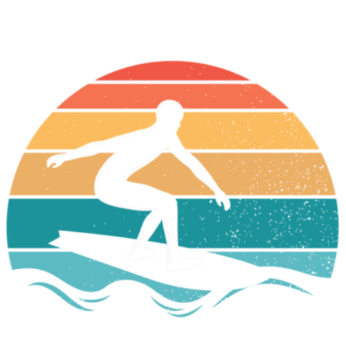
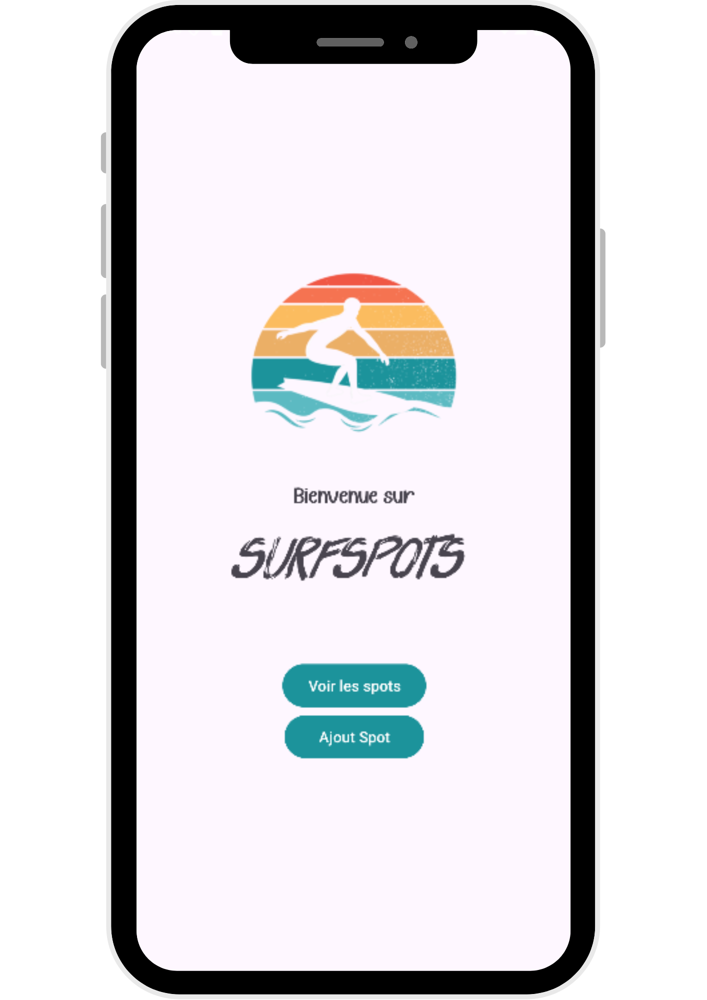
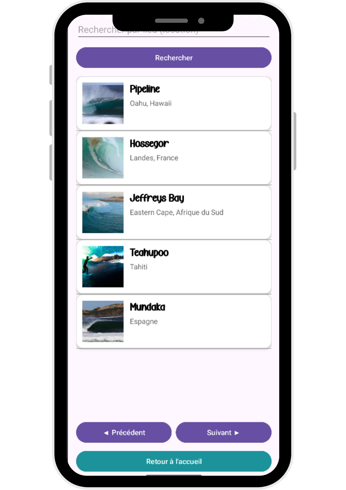
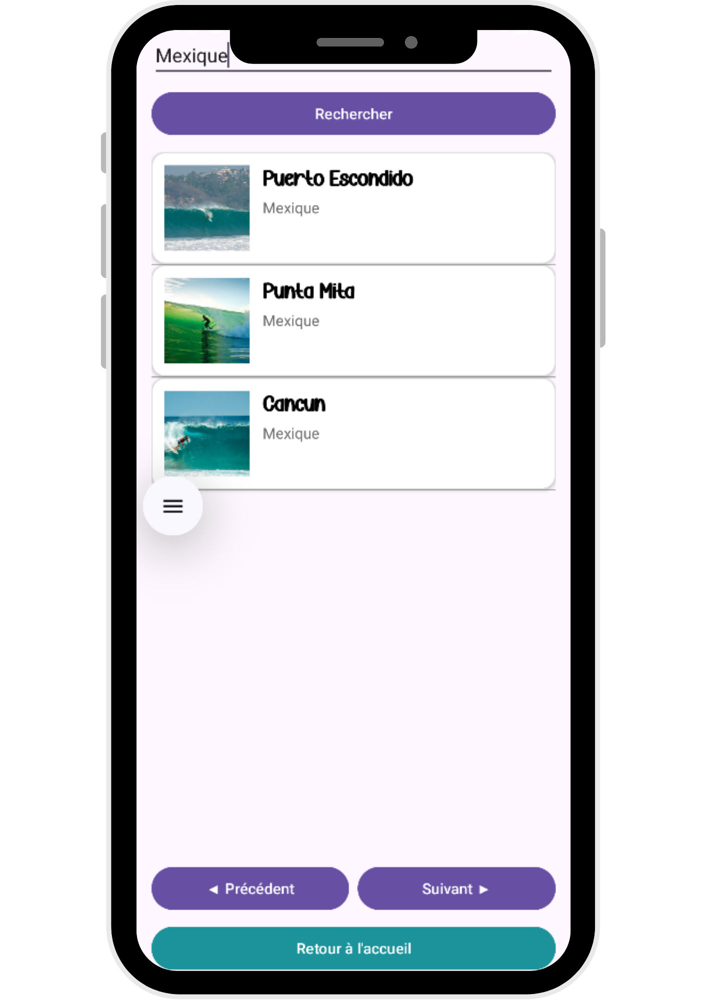
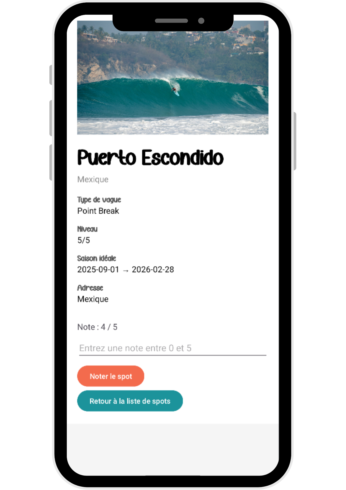
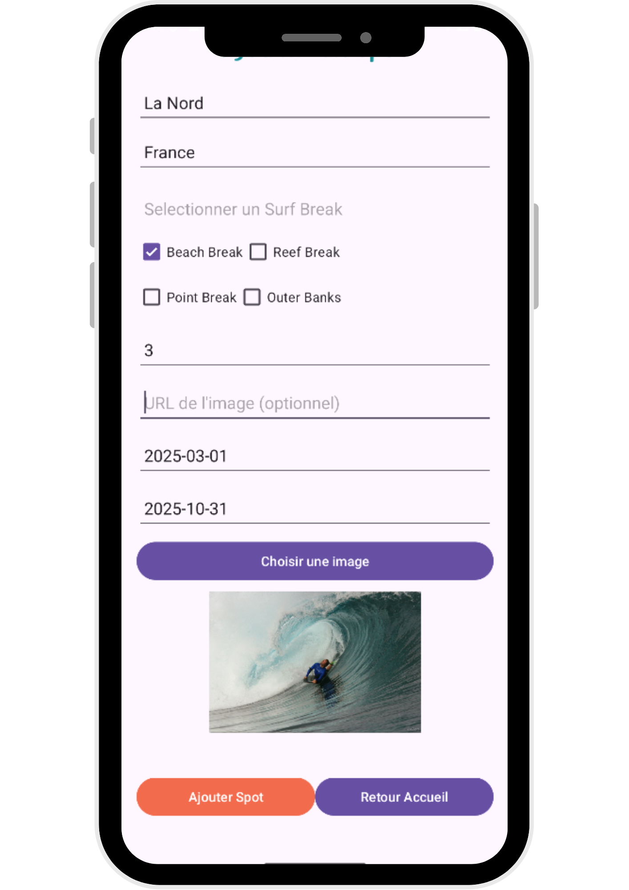

# SurfSpots 🌊

<p align="center">
  
</p>

## 📌 Présentation

**SurfSpots** est une application mobile Android développée en Kotlin qui permet de découvrir, ajouter et noter des spots de surf.  
Elle utilise une API REST construite avec Go (Gorilla Mux) en back-end et affiche les données dans une interface Android responsive.

Les utilisateurs peuvent consulter les spots existants, ajouter de nouveaux lieux, charger une photo depuis leur galerie ou choisir une url, et attribuer une note à chaque spot.

## 📷 ScreenShots du projet

<div style="display: flex; justify-content: space-around;">










</div>


---


## 🛠️ Technologies utilisées

### 🧩 Front-end (Mobile Android) :
- Kotlin
- Android Studio
- Glide (chargement d'images locales et distantes)
- Volley (requêtes HTTP)
- XML (layouts)

### 🔙 Back-end (API REST) :
- Go
- Gorilla Mux
- Base de données : MySQL
- Interface PHPMyAdmin

## 🚀 Lancement du projet

### 1. Cloner le projet

```bash
git clone https://github.com/Elo-S38/SurfSpots.git
```

### 2. Ouvrir dans Android Studio

1. Ouvre Android Studio
2. Clique sur "Open an existing project"
3. Sélectionne le dossier `SurfSpots`
4. Assure-toi d'avoir un émulateur ou un appareil Android connecté

### 3. Configuration de l’API

- Les fichiers Kotlin `SpotActivty`, `SpotDetailActivty`(pour l'envoi de note et la requête), `AjoutSpotActivty`  pointent par défaut vers `http://10.0.2.2:8080/api/spots` pour utiliser l’API Go en local.
- Démarre l’API Go depuis le dossier serveur avec :

```bash
go run main.go
```

---

## ✨ Fonctionnalités

- 📍 Liste des spots de surf
- ➕ Ajout de nouveaux spots avec photo
- 🌅 Chargement d'images depuis la galerie ou url
- ⭐ Attribution d’une note à un spot
- 🔍 Filtrage des spots par localisation
- 📄 Détail d’un spot sélectionné

---


## 👩‍💻 Auteurs
- **Neelab Sadat** – Développeuse Android & back-end Go (Projet pédagogique SurfSpots – 2025)
- **Vincent Bourgin** – Développeur Android & back-end Go (Projet pédagogique SurfSpots – 2025)
- **Élodie Sorce** – Développeuse Android & back-end Go (Projet pédagogique SurfSpots – 2025)

